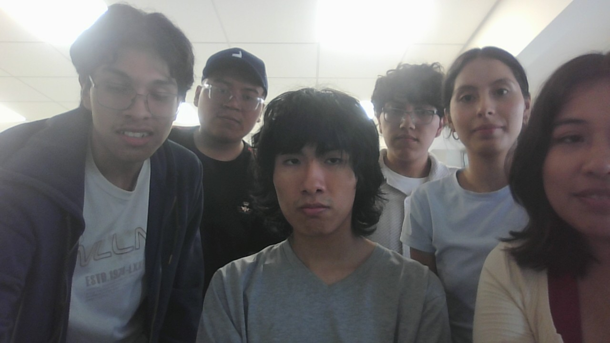

  

---

<b>
 FUNDAMENTOS DE BIODISEÑO 2025-2 </b>
<h1>
 EQUIPO 6 
</h1>

# 📌 Presentación del Equipo

Bienvenidos a la presentación oficial de nuestro equipo.  
Aquí encontrarás información sobre cada integrante, sus roles y responsabilidades.  

---

## 📸 Foto Grupal

  

---

## 👥 Integrantes

### 🧑 Alexandra Eduarda Torres Rodriguez

- **Edad:** 18 años    
- **Rol:** rol1  
---

### 🧑 integrante 2
 

- **Edad:**  años   
- **Rol:**  
---

### 🧑 Integrante 3
 

- **Edad:**  años    
- **Rol:**   
---

### 👩 integrante 4
 

- **Edad:**  años  
- **Rol:** 
---

### 👩 Integrante 5
 

- **Edad:**  años    
- **Rol:**   
---

### 👩 Integrante 6
 

- **Edad:**  años    
- **Rol:**  
---
